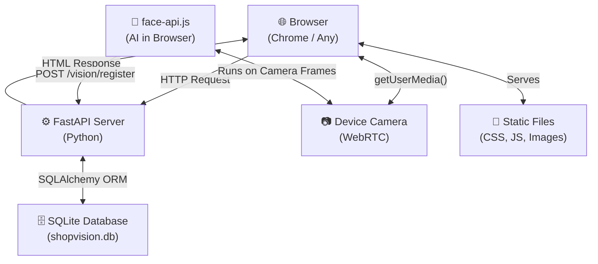
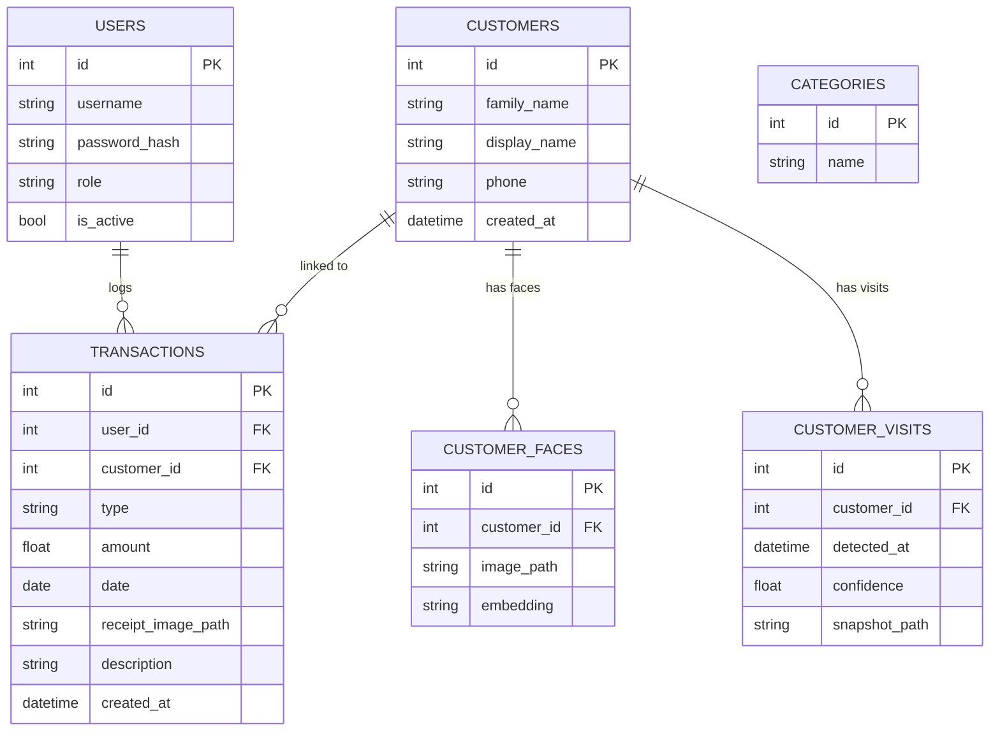
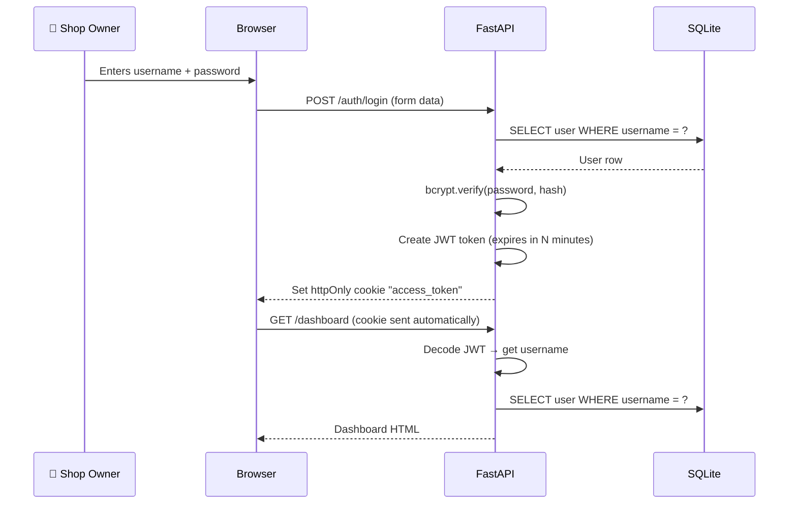
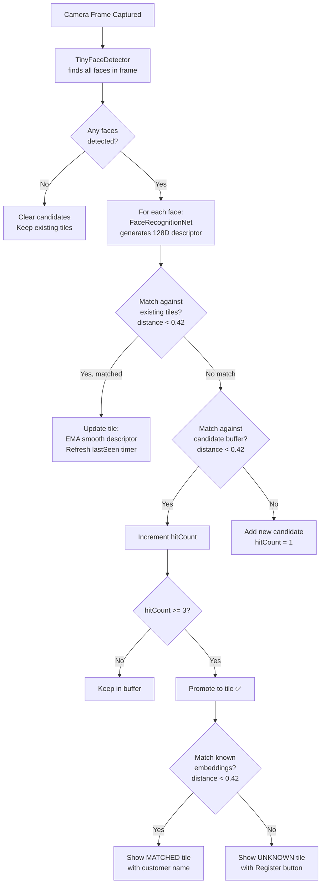
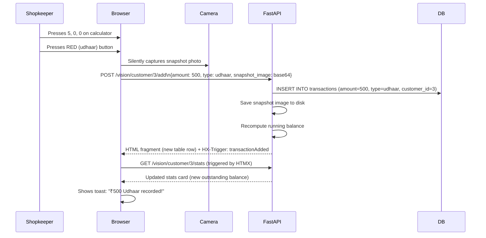

# ShopVision — Complete Project Explainer
### *"A smart face-recognition shop management system for Indian family shops"*

---

## 1. What Is This Project?

ShopVision is a **web application** built for small Indian family shops (like a kirana/general store). It solves two problems that shop owners face every day:

1. **Udhaar (Credit) Tracking** — When a family takes goods on credit, the shopkeeper has to remember who owes how much. Traditionally this is done with a paper notebook (bahi-khata). This app replaces that with a digital ledger per family.

2. **Face Recognition** — The camera on a laptop/tablet watches the shop entrance. When a **known customer** walks in, their name and outstanding balance shows up automatically on screen — no manual search needed. When an **unknown person** walks in, the shopkeeper can register them with a name.

---

## 2. The Big Picture — How Everything Connects



> **Key idea:** The browser does the heavy face-detection work using JavaScript. The Python server only stores results and serves pages. This way the server stays fast and light.

---

## 3. Tech Stack — Every Tool Explained

### 🐍 Backend (Python)

| Tool | What It Does | Why We Use It |
|---|---|---|
| **FastAPI** | The web framework — handles all HTTP routes (URLs) | Very fast, modern, auto-generates API docs |
| **Uvicorn** | The server that actually runs FastAPI | Async (can handle many requests at once) |
| **SQLAlchemy** | ORM — lets us write Python objects instead of raw SQL | Safe, prevents SQL injection, easy to read |
| **SQLite** | The database file (`shopvision.db`) | Zero setup, single file, perfect for small shops |
| **Alembic** | Database migration tool | Safely changes DB structure without losing data |
| **Jinja2** | HTML template engine | Python variables injected into HTML pages |
| **Passlib + bcrypt** | Password hashing | Passwords stored as hashes, never plain text |
| **python-jose** | JWT token creation/validation | Stateless authentication via cookies |
| **python-dotenv** | Reads `.env` config file | Keeps secrets out of code |

### 🌐 Frontend (Browser)

| Tool | What It Does | Why We Use It |
|---|---|---|
| **HTMX** | Lets HTML elements make HTTP requests without writing JS | Pages feel dynamic without a full JS framework |
| **Alpine.js** | Lightweight JS for UI state (modals, camera loop) | Declarative, small, works with Jinja2 templates |
| **face-api.js** | AI face detection + recognition running in the browser | No GPU server needed, runs locally on device |
| **TailwindCSS** | Utility-first CSS framework | Rapid styling, responsive by default |
| **Geist Mono / Clash Display** | Custom fonts from Google Fonts | Premium terminal-inspired look |

### 🗃️ Storage

| What | Where |
|---|---|
| All structured data (users, transactions, customers) | `shopvision.db` (SQLite file) |
| Face photos | `app/static/uploads/faces/` |
| Transaction snapshot photos | `app/static/uploads/transactions/` |
| Receipt images | `app/static/uploads/receipts/` |

---

## 4. Folder Structure — What Each Folder Does

```
shop-vision-sahaj/
│
├── app/                         ← Main application package
│   ├── main.py                  ← App entry point (registers all routes, starts DB)
│   ├── config.py                ← Settings loaded from .env file
│   ├── database.py              ← SQLite engine + session setup
│   ├── dependencies.py          ← Shared helpers (auth guard, DB session injector)
│   │
│   ├── models/                  ← Database table definitions (SQLAlchemy ORM)
│   │   ├── user.py              ← Shop owner / cashier accounts
│   │   ├── customer.py          ← Customer + their face embeddings + visit logs
│   │   ├── transaction.py       ← Every udhaar/payment record
│   │   ├── category.py          ← Transaction categories (optional)
│   │   ├── receipt.py           ← Receipt image records
│   │   └── widget.py            ← Dashboard widget config
│   │
│   ├── routers/                 ← URL route handlers (one file per feature)
│   │   ├── auth.py              ← /auth/login, /auth/logout, /auth/register
│   │   ├── dashboard.py         ← /dashboard
│   │   ├── vision.py            ← /vision (camera), /vision/customer/:id
│   │   ├── transactions.py      ← /transactions (CRUD)
│   │   ├── reports.py           ← /reports
│   │   └── widgets.py           ← /widgets (dashboard cards, HTMX partials)
│   │
│   ├── services/                ← Business logic (separate from routes)
│   │   ├── auth_service.py      ← Password hash, JWT creation
│   │   └── transaction_service.py ← Create/read/update/delete transactions
│   │
│   ├── schemas/                 ← Pydantic models (validate incoming form data)
│   │   ├── user.py              ← UserCreate schema
│   │   └── transaction.py       ← TransactionCreate schema
│   │
│   ├── static/                  ← Files served directly (no Python processing)
│   │   ├── css/app.css          ← Custom CSS (animations, glass effects, theme)
│   │   ├── js/app.js            ← Shared JavaScript utilities
│   │   └── uploads/             ← Saved face/receipt images
│   │
│   └── templates/               ← Jinja2 HTML files
│       ├── base.html            ← Master layout (navbar, footer, fonts, scripts)
│       ├── dashboard/           ← Dashboard page
│       ├── vision/              ← Vision + family ledger pages
│       │   ├── index.html       ← Camera feed + live detection
│       │   ├── families.html    ← All families list
│       │   ├── customer_page.html ← Individual family ledger + calculator
│       │   └── partials/        ← Small HTML fragments for HTMX swaps
│       ├── auth/                ← Login + register pages
│       └── transactions/        ← Transaction list + form modals
│
├── shopvision.db                ← The actual database (SQLite file)
├── requirements.txt             ← Python package list
├── .env                         ← Secret config (DB path, JWT secret, etc.)
└── Dockerfile                   ← For containerized deployment
```

---

## 5. Database Schema — What Gets Stored



### Key fields explained:
- **`embedding`** in `customer_faces` — stores a 128-number array (called a face descriptor) as JSON text. This is the "face fingerprint" that AI generates.
- **`type`** in `transactions` — either `"udhaar"` (credit given, shop is owed money) or `"payment"` (money received). The running balance = sum of udhaar − sum of payments.
- **`receipt_image_path`** in `transactions` — path to a photo automatically taken when a transaction was recorded (the camera snapshot).

---

## 6. Authentication System — How Login Works



**What is JWT?** JSON Web Token. It's an encoded string that contains the username and expiry time. It's mathematically signed so it can't be faked. The server puts it in a cookie so every future browser request automatically includes it.

**What is bcrypt?** A one-way hashing algorithm. The actual password is NEVER stored. Only the hash. When you log in, bcrypt re-hashes what you typed and checks if it matches the stored hash.

---

## 7. The Vision / Face Recognition System — Most Complex Feature

This is the core innovation of the project. Here's how it works step by step:

### Step 1: Models Load (One-time on page open)
```
Browser opens /vision
    → Downloads 3 AI model files from CDN (face-api.js weights)
        1. TinyFaceDetector   → Finds WHERE faces are in the image
        2. FaceLandmark68Net  → Finds 68 key points (eyes, nose, mouth, etc.)
        3. FaceRecognitionNet → Converts face to 128-number vector
    → Fetches all known customer embeddings from /vision/embeddings
```

### Step 2: The Detection Loop (Runs every 300ms)


> **Why the 3-frame stability buffer?** Without it, every slight head movement spawned a new tile because the embedding changes slightly. Now a face must be seen consistently 3 times before any tile appears, eliminating false positives.

> **What is EMA (Exponential Moving Average)?** Instead of snapping the descriptor to the latest frame, we blend old (60%) + new (40%). This keeps recognition stable even as the person moves their head slightly.

### Step 3: Registering a New Face
```
Shopkeeper clicks "Add New" on unknown tile
    → Types family name (e.g. "Sharma")
    → Clicks Save
    → Browser sends to POST /vision/register:
        - family_name
        - display_name (optional)  
        - phone (optional)
        - embedding (128 numbers as JSON)
        - image_data (base64 JPEG of the face crop)
    → Server creates Customer record in DB
    → Server creates CustomerFace record (embedding + image path)
    → Browser re-fetches /vision/embeddings
    → Next time this person appears → immediately MATCHED
```

### Step 4: When a Known Customer is Detected
- Their tile shows: **"Sharma Family"** + **MATCHED** badge
- Clicking **"OPEN LEDGER →"** navigates to `/vision/customer/3`

---

## 8. The Customer Ledger Page — Calculator UX

This page is designed for touch/tablet use. When you open a customer's page:

```
/vision/customer/{id}
    → Server computes:
        - All transactions (paginated, 10 per page)
        - Running balance for each row
        - Outstanding total (sum of udhaar − sum of payments)  
        - Top 3 quick-amount suggestions (most-used amounts)
    → Renders customer_page.html with:
        - Calculator (0-9 buttons, backspace)
        - Red button = Udhaar (credit given, they owe you)
        - Green button = Payment received
        - Transaction history table
```

### How a Transaction is Recorded:


**Key concept: HTMX Partial Updates** — Instead of reloading the whole page, HTMX swaps in only the new table row and the stats card. The page stays alive, no full reload.

---

## 9. Dashboard — What the Shop Owner Sees

The dashboard is built with **HTMX widgets** — each card on the page is loaded independently:

| Widget | Route | What It Shows |
|---|---|---|
| Pending Credits | `/widgets/pending-credits` | Total udhaar outstanding across ALL customers |
| Today's Sales | `/widgets/today-sales` | Sum of all payment transactions today |
| Recent Activity | `/widgets/recent-activity` | Last 5 transactions |
| Quick Add | `/widgets/quick-add` | Fast form to record a transaction |

Each widget hits its own URL and renders independently. This means if one widget is slow, the rest of the page already loaded.

---

## 10. The HTMX + Alpine.js Pattern — How Dynamic UI Works Without React

A typical web app today uses React or Vue for dynamic UI. This project uses a simpler, older-school pattern:

### HTMX
HTML attribute that makes any element fire HTTP requests:
```html
<!-- This button, when clicked, POSTs to /transactions/add 
     and puts the response HTML into #transaction-list -->
<button hx-post="/transactions/add" 
        hx-target="#transaction-list" 
        hx-swap="afterbegin">
  Add Transaction
</button>
```

The server returns **HTML fragments** (not JSON). HTMX inserts them directly into the page.

### Alpine.js  
Handles local UI state that doesn't need the server:
```html
<!-- This div manages open/close state of a modal -->
<div x-data="{ open: false }">
  <button @click="open = true">Open Modal</button>
  <div x-show="open">Modal content here</div>
</div>
```

### HX-Trigger (Server-sent events)
When a transaction is added, the server sends back a header: `HX-Trigger: transactionAdded`. Other elements on the page listen for this and auto-refresh:
```html
<div hx-get="/widgets/pending-credits" 
     hx-trigger="transactionAdded from:body">
```
This is how the stats card updates automatically after a transaction is posted.

---

## 11. Security Model

| Concern | How It's Handled |
|---|---|
| Password storage | bcrypt hashing — passwords never stored plain |
| Session | httpOnly JWT cookie — JavaScript cannot read it |
| Route protection | `Depends(get_current_user)` on every route — invalid token = 401 redirect to login |
| SQL injection | SQLAlchemy ORM — no raw SQL strings with user input |
| File uploads | UUID-named files, saved to a controlled directory, never executable |

---

## 12. How to Run the Project

```bash
# 1. Create virtual environment
python -m venv .venv
.venv\Scripts\activate          # Windows

# 2. Install dependencies
pip install -r requirements.txt

# 3. Configure environment
cp .env.example .env
# Edit .env: set SECRET_KEY, DATABASE_URL, etc.

# 4. Start the server
uvicorn app.main:app --host 0.0.0.0 --port 8000 --reload

# 5. Open browser
# http://localhost:8000  →  redirects to /dashboard → redirects to /auth/login
```

---

## 13. Complete Request-Response Flow (Full Example)

> *"Shopkeeper opens camera, Sharma family walks in, shopkeeper records ₹200 udhaar"*

```
1. GET /vision
   → FastAPI checks JWT cookie → valid → renders vision/index.html

2. Browser:
   → Loads face-api.js models from CDN (one-time, ~2-3 seconds)
   → GET /vision/embeddings → gets [{family_name: "Sharma", embedding: [...128 numbers...]}]
   → Opens camera (getUserMedia)
   → Starts detection loop (every 300ms)

3. Sharma walks in:
   → Frame 1: face detected, candidate buffer: hitCount=1
   → Frame 2: same face, hitCount=2
   → Frame 3: same face, hitCount=3 → PROMOTED to tile
   → Euclidean distance vs Sharma embedding = 0.31 (< 0.42) → MATCHED
   → Tile shows: "Sharma Family — MATCHED"

4. Shopkeeper clicks "OPEN LEDGER →"
   → Browser navigates to GET /vision/customer/7
   → FastAPI: queries all transactions for customer_id=7
   → Renders customer_page.html with calculator + history

5. Shopkeeper presses: 2, 0, 0 → RED button
   → Camera silently captures snapshot
   → POST /vision/customer/7/add
       {amount: 200, type: "udhaar", snapshot_image: "data:image/jpeg;base64,..."}
   → FastAPI creates Transaction(amount=200, type="udhaar", customer_id=7)
   → Saves snapshot image → path stored in receipt_image_path
   → Returns HTML row + HX-Trigger: transactionAdded

6. HTMX inserts new row at top of transaction table
   HTMX refreshes stats card → Outstanding: ₹200 shown

7. Toast notification: "₹200 Udhaar recorded"
```

---

## 14. What Makes This Project Stand Out

| Feature | Technical Achievement |
|---|---|
| **On-device face recognition** | 128D face embeddings compared using Euclidean distance, no cloud API |
| **3-frame stability buffer** | Eliminates false-positive tile creation on slight movement |
| **EMA descriptor smoothing** | Stable recognition across natural head movement |
| **Partial page updates** | HTMX swaps only changed HTML; no page reloads, no React needed |
| **Silent camera snapshot** | Automatic photo at transaction time without user interruption |
| **Running balance per row** | Computed server-side oldest→newest, shows exact balance at each point |
| **Offline-first architecture** | SQLite + local server = works without internet |
| **Quick amount suggestions** | Top 3 most-used amounts per customer fetched from DB aggregate query |

---

## 15. Glossary of Terms

| Term | Meaning |
|---|---|
| **ORM** | Object-Relational Mapper — lets you use Python classes instead of SQL |
| **JWT** | JSON Web Token — a signed token proving who you are |
| **bcrypt** | A password hashing algorithm (slow by design, so brute force is hard) |
| **Embedding / Descriptor** | A 128-number mathematical representation of a face |
| **Euclidean Distance** | Math formula: distance between two points in 128D space. Close = same person |
| **HTMX** | Library that lets HTML elements make HTTP requests |
| **Jinja2** | Python's HTML template engine (like filling in blanks in HTML) |
| **FastAPI** | Python web framework (like Django but faster and more modern) |
| **Uvicorn** | ASGI server — the thing that actually listens for HTTP connections |
| **SQLite** | A database stored in a single `.db` file, no server needed |
| **Partial / Fragment** | A small piece of HTML returned by server, not a full page |
| **EMA** | Exponential Moving Average — smoothly blends old and new values |
| **Udhaar** | Hindi: credit / debt — when shop gives goods before payment |
| **Bahi-Khata** | Traditional paper ledger used by Indian shop owners |
